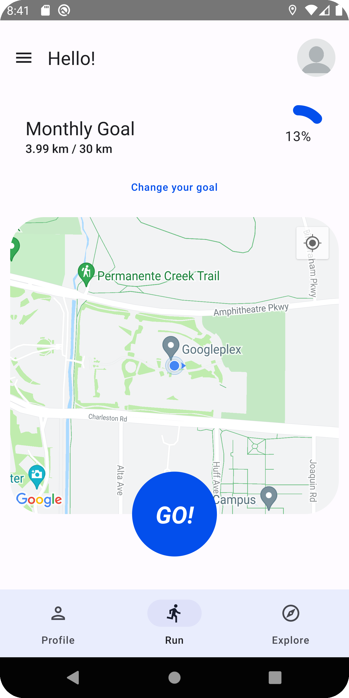
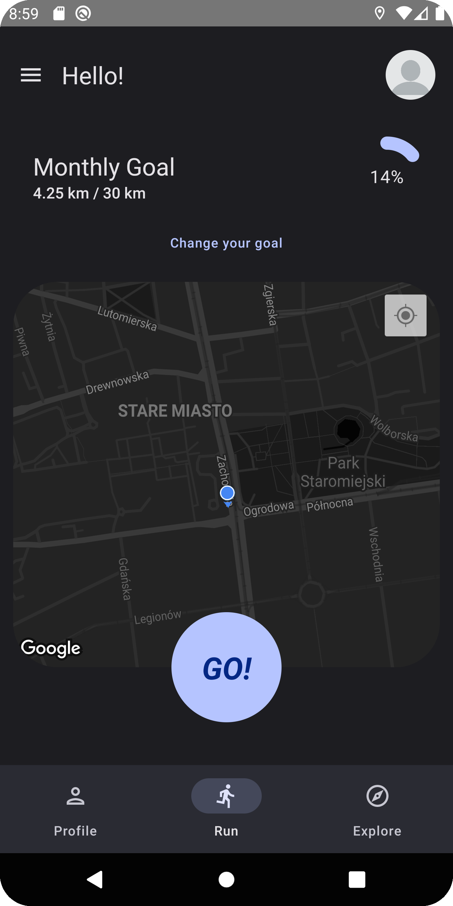
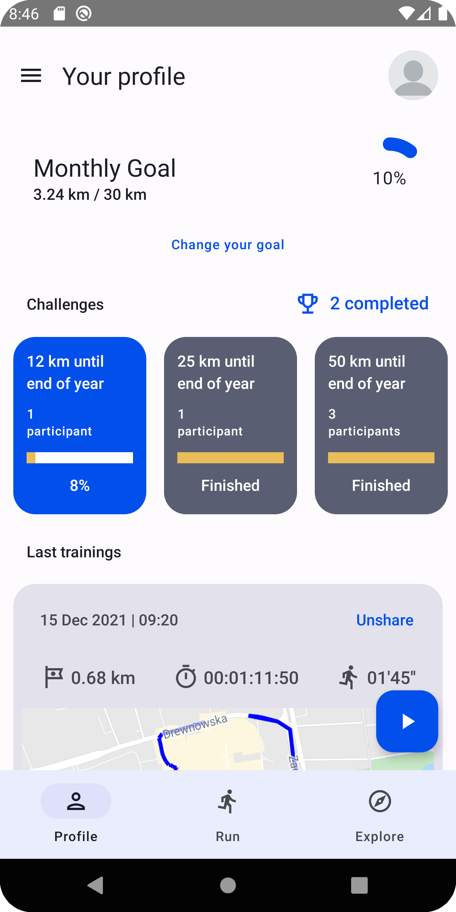
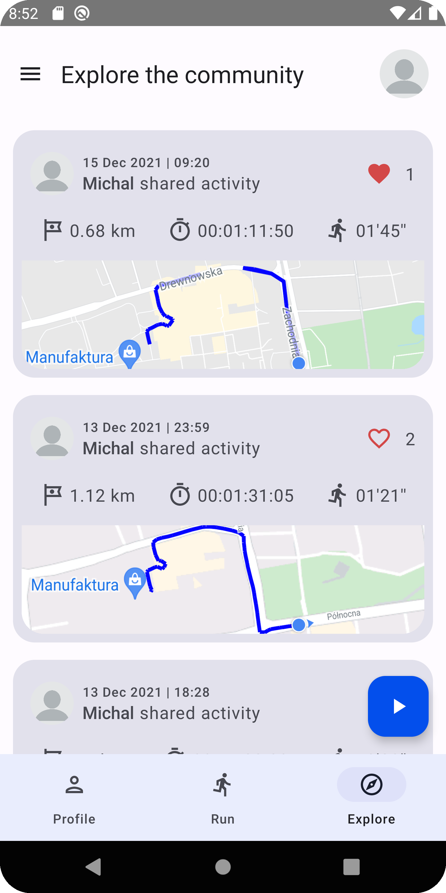
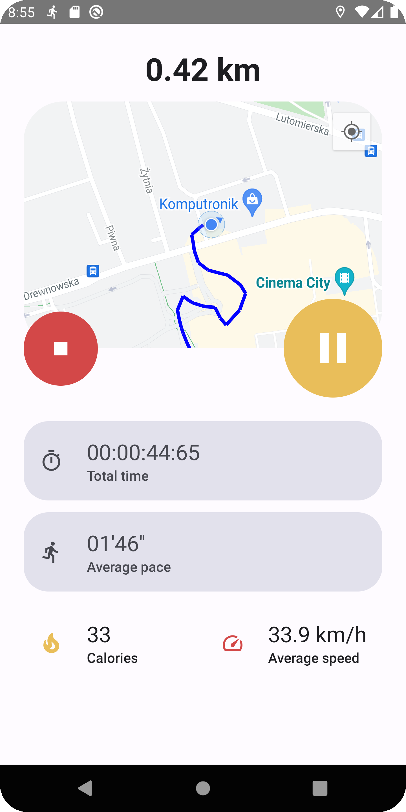

# running-app-android

## About the project
The application was created as an academic project to help runners keep track of their training statistics and routes run

### Features
* real-time statistics tracking
* presentation of the route on the map
* list of completed activities
* sharing activities with other users
* individual running goals
* running challenges 

### Built with
* Kotlin
* Jetpack Compose
* Material Design
* Google Maps SDK
* <a href="https://github.com/marcinsitkiewicz/running-app-backend">Back-end</a>

### Screenshots

 
 
 
 
 

